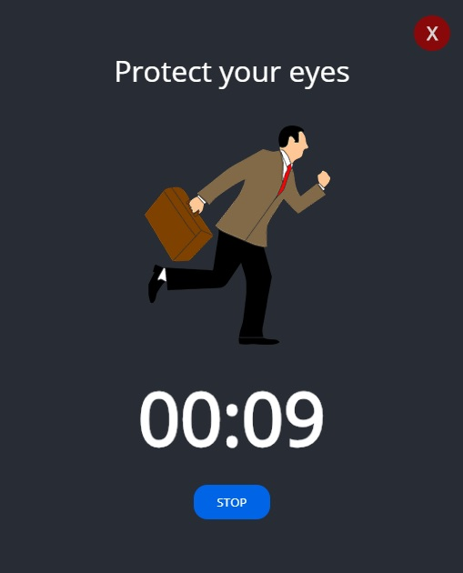

<p align="center">

</p>


# <p align="center">👁‍🗨 Protect your eyes desktop app (Electron)</p>
<p align="center">Project for learning Electron (building desktop apps using JavaScript, HTML and CSS)</p>

</br>

## Table of Contents

- [What's this project about?](#about)
- [Technologies used](#technologies)
- [What I learned?](#what)
- [Interesting code snippet](#interesting)
- [Installation and quick start](#install)

</br>

## <a name="about"></a>What's this project about?

This is desktop application for measuring the time spent in front of the monitor. Informs about the time for a break and looking far ahead for 20 seconds. For the good health of your eyes :)

</br>

## <a name="technologies"></a>Technologies used
- Electron
- HTML
- CSS
- JavaScript
- React
- GIT
- npm

</br>

## <a name="what"></a>What I learned?
- work with [Electron](https://www.electronjs.org/docs) - tool for creating desktop window applications using HTML, CSS and JavaScript,
- check Electron's supported features and functions ([Can I use?](https://caniuse.com/) - check for Google Chrom),
- use tamplets to get started with Electron (eg. [electron-quick-start](https://github.com/electron/electron-quick-start)),
- combine work with Electron and React,
- use [electron-packager](https://github.com/electron/electron-packager) to bundle Electron-based application into folders ready for distribution on OS,
- difference between `npm` and `yarn`,
- how does the [npmjs.com](https://www.npmjs.com/) website work,
- create and publish my own `npm` package ([id-generator](https://www.npmjs.com/package/@grzegorz-jodlowski/npm-package-id-generator)),
- how the npm package version naming system is built (eg. "^16.8.6" - major, minor, patch).

</br>

## <a name="interesting"></a>Interesting code snippet (for me of course 😉)
- Electron setup:

```js
'use strict';

const path = require('path');
const { app, BrowserWindow } = require('electron');

function main() {

  // create new window
  let mainWindow = new BrowserWindow({
    webPreferences: {
      nodeIntegration: true
    },
    width: 520,
    height: 640,
    frame: false,
  })

  // load app/index.html as the window content
  mainWindow.loadFile(path.join('app', 'index.html'));
}

app.on('ready', main);

app.on('window-all-closed', function () {
  app.quit();
});
```
- npm-package-id-generator:

```js
const randomID = (idLength) => {
  let id = '';
  const characters = 'ABCDEFGHIJKLMNOPQRSTUVWXYZabcdefghijklmnopqrstuvwxyz0123456789';
  const charsAmount = characters.length;
  for (let i = 0; i < idLength; i++) {
    id += characters.charAt(Math.floor(Math.random() * charsAmount));
  }
  return id;
}

module.exports = randomID;
```

</br>

## <a name="install"></a>Installation and quick start

- use the package manager [npm](https://www.npmjs.com/get-npm) or [yarn](https://classic.yarnpkg.com/en/) to install dependencies:

```bash
npm install // yarn install

or

npm i
```
- run desktop app:

```bash
npm start

or

yarn start
```

</br>
</br>

  *project implemented as part of the 9-month [Web Developer Plus](https://kodilla.com/pl/bootcamp/webdeveloper/?type=wdp&editionId=309) course organized by [Kodilla](https://drive.google.com/file/d/1AZGDMtjhsHbrtXhRSIlRKKc3RCxQk6YY/view?usp=sharing).
